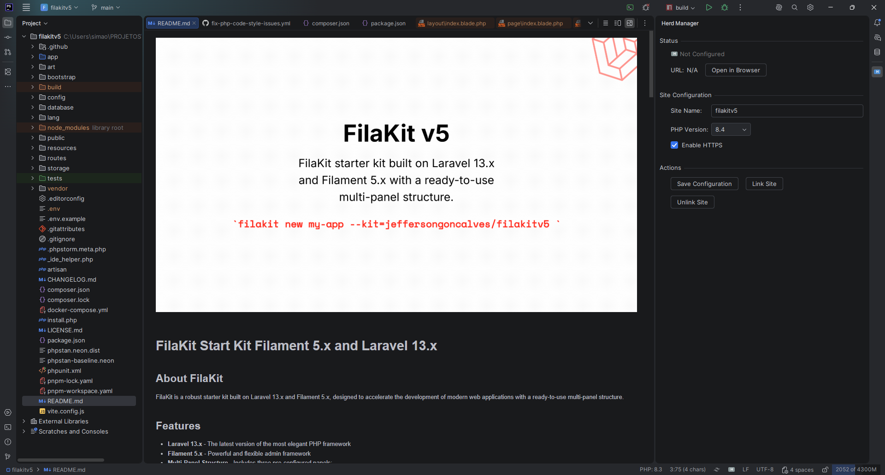
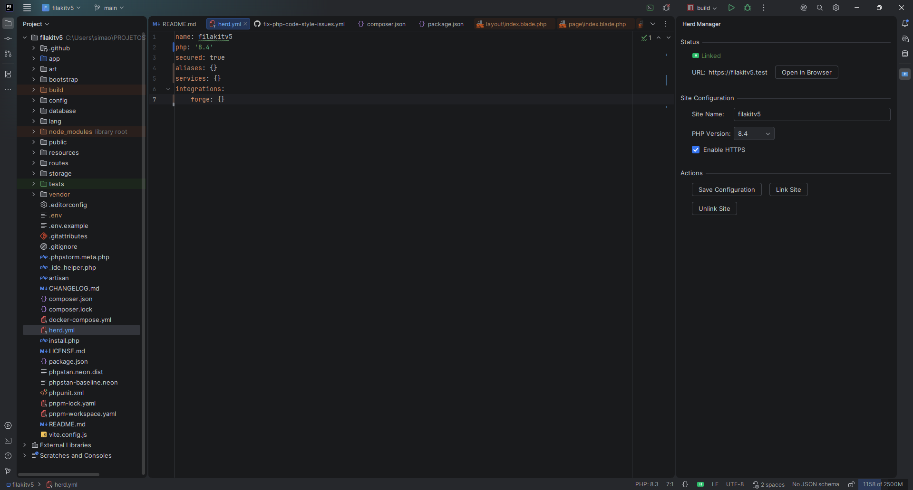

# Herd Manager

> Manage Laravel Herd site configuration directly from PhpStorm.

**Herd Manager** is a JetBrains plugin that integrates [Laravel Herd](https://herd.laravel.com) into your IDE, letting you configure, link, and manage Herd sites without leaving your editor.

## Screenshots

| Not Configured | Configured & Linked |
|:-:|:-:|
|  |  |

## Features

- **Auto-detection** — Detects Laravel Herd installation on Windows, macOS, and Linux
- **Project configuration** — Create and edit `herd.yml` with site name, PHP version, and HTTPS settings
- **Site linking** — Link/unlink projects to Herd with one click
- **SSL management** — Secure sites with HTTPS directly from the IDE
- **Status bar widget** — See link status at a glance in the IDE status bar
- **Tool window panel** — Full configuration UI in the right sidebar
- **Smart notifications** — Prompts to configure or link on project open
- **Reactive updates** — UI auto-refreshes when `herd.yml` changes externally

## Requirements

- **IDE**: PhpStorm 2024.3+ (or any IntelliJ-based IDE with PHP plugin, builds 243–263.*)
- **Laravel Herd**: Installed and available in system PATH or default location
- **Java**: JDK 17+

## Installation

### From JetBrains Marketplace

1. Open PhpStorm → **Settings** → **Plugins** → **Marketplace**
2. Search for **"Herd Manager"**
3. Click **Install** and restart the IDE

Or install directly from: [Herd Manager on JetBrains Marketplace](https://plugins.jetbrains.com/plugin/31013-herd-manager)

### From Disk

1. Download the latest release `.zip` from [Releases](https://github.com/jeffersongoncalves/herd-manager-plugin/releases)
2. Open PhpStorm → **Settings** → **Plugins** → **⚙️** → **Install Plugin from Disk...**
3. Select the `.zip` file and restart the IDE

## Usage

### Quick Start

1. Open a Laravel project in PhpStorm
2. The plugin auto-detects Herd and checks for `herd.yml`
3. If no config exists, a notification offers to **Configure Now**
4. Set your site name, PHP version, and HTTPS preference
5. Click **Link Site** to register with Herd

### Tool Window

Access via **View → Tool Windows → Herd Manager** or click the Herd icon in the right sidebar.

| Section | Description |
|---------|-------------|
| **Status** | Shows linked/unlinked state and site URL with "Open in Browser" button |
| **Site Configuration** | Edit site name, select PHP version, toggle HTTPS |
| **Actions** | Save config, link/unlink site |

### Actions Menu

Available under **Tools → Herd**:

- **Configure Site** — Open the Herd Manager tool window
- **Link Site** — Link the current project to Herd (creates config if needed)
- **Open in Browser** — Open the site URL in your default browser

### Status Bar

The status bar widget (bottom-right) shows:
- **Linked icon** — Site is registered with Herd (hover for URL)
- **Unlinked icon** — Site is not linked (click to configure)

### herd.yml

The plugin manages a `herd.yml` file in your project root:

```yaml
name: my-project
php: '8.4'
secured: true
aliases: []
services: []
integrations: []
```

## Building from Source

```bash
# Clone the repository
git clone git@github.com:jeffersongoncalves/herd-manager-plugin.git
cd herd-manager-plugin

# Build the plugin
./gradlew buildPlugin

# Run PhpStorm sandbox with plugin loaded
./gradlew runIde

# Run tests
./gradlew test

# Verify plugin compatibility
./gradlew verifyPlugin
```

The built plugin archive will be in `build/distributions/`.

## License

[MIT](LICENSE)

## Author

**Jefferson Goncalves** — [GitHub](https://github.com/jeffersongoncalves)
